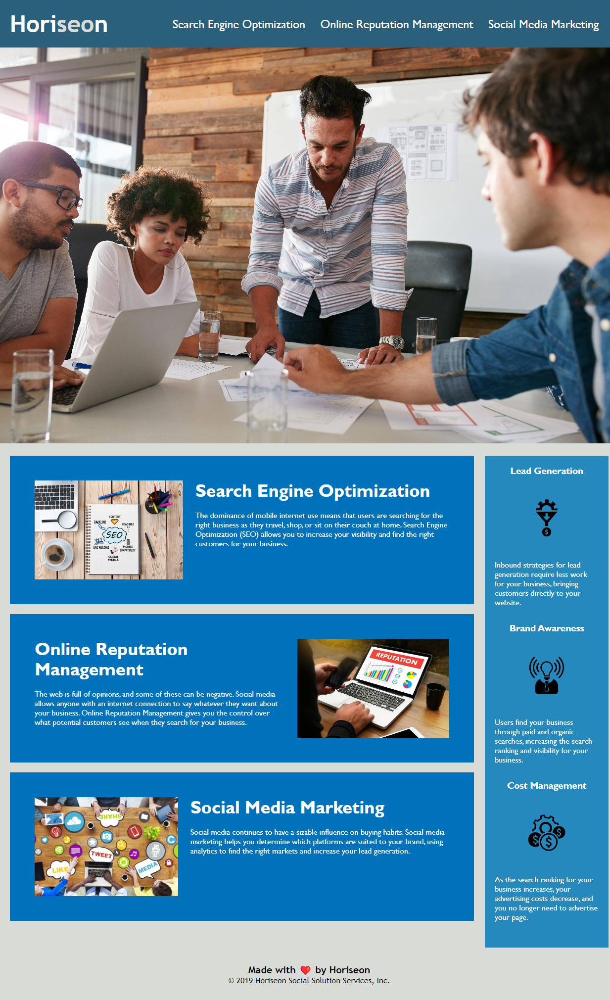

# Module 1 Challenge

## Description

This project was a refactor for a company called Horiseon that provides various web services to clients. In this refactor I consolidated CSS stylings for more efficiency, improved accessibility, and modeled the HTML in a semantic format for easier dissemination and future development.

## Usage

The website can be found at this URL: https://willj30.github.io/Module-1-Challenge/

Website Screenshot:

   

## Credits

Web Resources:

"HTML Semantic Elements": https://www.w3schools.com/html/html5_semantic_elements.asp

Tutorials:

"Coding with semantic and structural elements": https://www.youtube.com/watch?v=DvWxbh0Jjxc&t=274s

## License

MIT License

